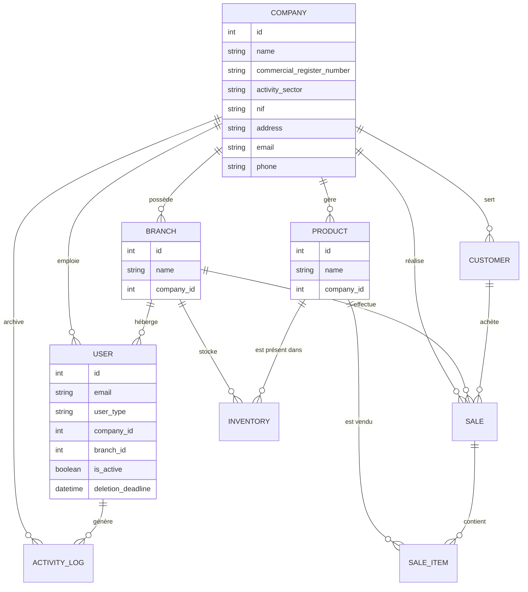

# Résumé Technique : OMNISTOCK ERP

## 1. Architecture Multi-Tenant & Isolation
OMNISTOCK utilise une architecture multi-tenant logique basée sur l'isolation des données via une clé étrangère `company_id` présente sur toutes les entités clés (User, Company, Branch, Product, Sale, PurchaseOrder, etc.).
- **Isolation Active** : Les requêtes API extraient de manière sécurisée le `company_id` à partir du token d'authentification JWT validé par FastAPI. Les filtres SQL sont appliqués systématiquement pour interdire tout accès inter-tenant.
- **Middleware de Sécurité** : Intercepte les modifications pour assurer la restriction stricte des opérations.

## 2. Nouveautés de l'Architecture & Sécurité

### 2.1 Inscription d'Entreprise Enrichie
La création de compte intègre désormais les détails légaux et commerciaux requis :
- **Modèle Company** : `commercial_register_number` (RC), `nif` (Numéro d'Identification Fiscale), `activity_sector`, `address`, `email`, et `phone`.
- **Route d'inscription** : L'API `/register/enterprise` (alias de `/api/signup`) associe automatiquement le premier utilisateur inscrit comme propriétaire `ADMIN` de son entreprise.

### 2.2 Contrôle d'Accès Basé sur les Rôles (RBAC)
Le contrôle d'accès a été modularisé à l'aide de dépendances injectées par FastAPI :
1. `get_current_admin` : Restreint l'accès uniquement aux utilisateurs de type `ADMIN` (ex: vidage, seeding, deactivation, restore).
2. `get_current_agent_human` : Permet l'accès aux administrateurs (`ADMIN`) et aux agents humains (`HUMAIN`) (ex: création de clé API, gestion de stock manuelle, approbation de transferts).
3. `get_current_agent_ai` : Valide l'accès via clé API ou token JWT pour les administrateurs et les agents autonomes (`AGENT`).

### 2.3 Mécanisme de Désactivation Temporaire & Purge (Soft-Delete)
Gestion du cycle de vie des comptes inspirée d'Instagram :
- **Désactivation** : Un administrateur peut désactiver son compte (`is_active = False`). Un délai de 30 jours (`deletion_deadline`) est alors calculé et enregistré en base de données. Les données de l'entreprise sont gelées et l'accès est bloqué pour tous les utilisateurs liés.
- **Réactivation** : Si l'administrateur se reconnecte avant la fin des 30 jours, son compte est automatiquement réactivé (`is_active = True`, `deletion_deadline = None`).
- **Purge Définitive** : Passé les 30 jours, toute tentative de connexion de l'admin déclenche une purge en cascade définitive de l'utilisateur, de ses filiales, de ses produits, et de son entreprise de la base de données.

### 2.4 Restauration de la Base de Données
Le système inclut un endpoint de restauration robuste (`POST /api/admin/restore`) acceptant :
- **Fichiers JSON** : Désactive temporairement les clés étrangères SQLite pour vider et réinsérer les données ordonnées.
- **Fichiers SQL** : Exécute des scripts bruts SQLite complexes avec gestion transactionnelle.
- **Fichiers de base SQLite (.db)** : Écrase le fichier SQLite actif de manière sécurisée en fermant au préalable les connexions ORM actives.

---

## 3. Schéma de la Base de Données

