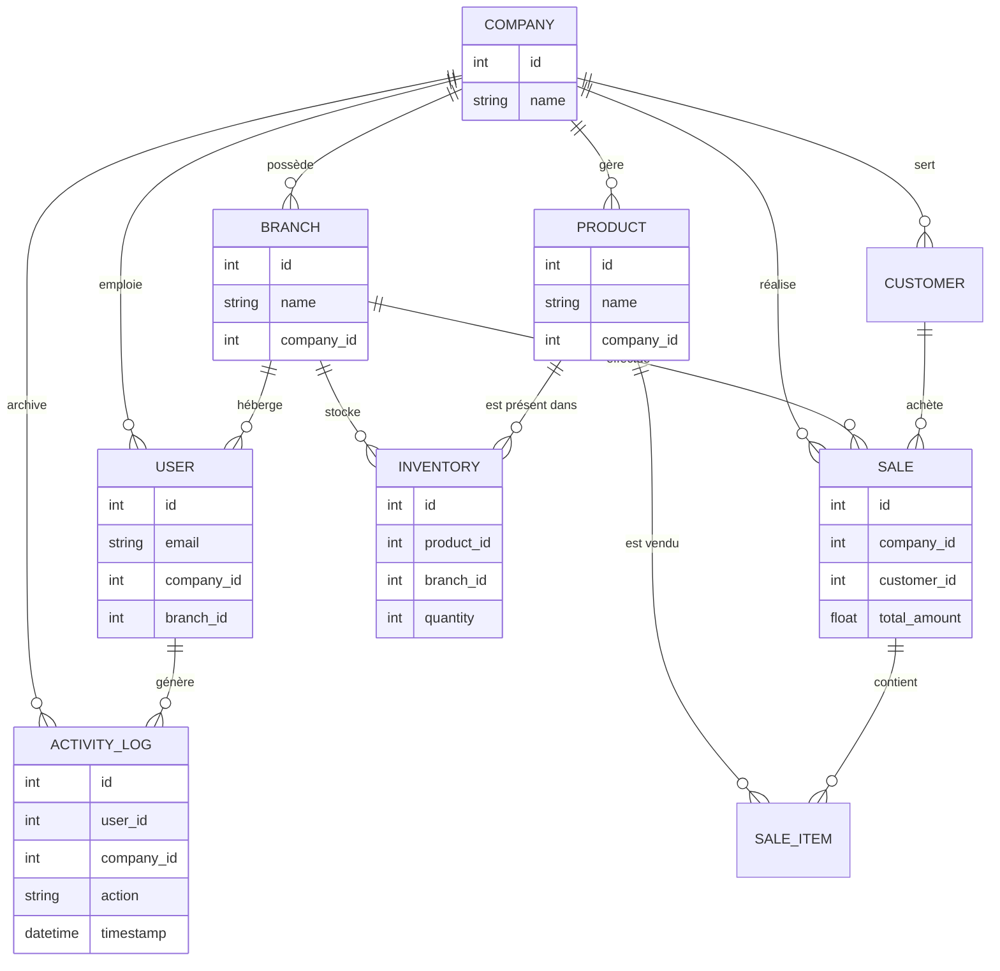

# Résumé Technique : OMNISTOCK ERP

## 1. Architecture Multi-Tenant
OMNISTOCK utilise une architecture multi-tenant robuste basée sur l'isolation des données au niveau logiciel via une colonne `company_id` présente dans toutes les tables critiques.
- **Isolation Stricte** : Chaque requête API filtre systématiquement les données par le `company_id` extrait du token JWT de l'utilisateur.
- **Middleware de Sécurité** : Un middleware FastAPI intercepte les requêtes `PUT` et `DELETE` pour vérifier que l'utilisateur a le droit de modifier la ressource demandée.
- **Indépendance des Données** : Deux entreprises différentes (ex: Pharmacie vs Alimentation) sont totalement étanches, avec leurs propres stocks, clients et historiques.

## 2. Fonctionnalités Clés
1. **Gestion Multi-Filiales** : Centralisation des stocks tout en permettant une gestion granulaire par dépôt ou boutique (ex: Alger vs Oran).
2. **Transferts Inter-Filiales Sécurisés** : Déplacement de stock atomique (Transaction ACID) avec vérification d'appartenance à la même entreprise.
3. **Module de Vente & Facturation** : Génération de factures HTML professionnelles et suivi des ventes en temps réel.
4. **Journaux d'Activité (Audit)** : Traçabilité complète des actions (connexions, ventes, transferts) pour une transparence totale.
5. **Dashboard Intelligent (MCP)** : Analyse prédictive des stocks et résumé business via une interface IA (Model Context Protocol).

## 3. Stack Technique
- **Backend** : FastAPI (Python 3.13) pour une API asynchrone haute performance.
- **Base de Données** : SQLite avec SQLAlchemy (ORM) pour la gestion des relations et des contraintes (CHECK, Index).
- **Sécurité** : JWT (JSON Web Tokens) pour l'authentification et passlib (bcrypt) pour le hachage des mots de passe.
- **Frontend** : Vanilla HTML/JS avec TailwindCSS pour une interface premium, réactive et sans framework lourd.

## 4. Schéma de la Base de Données

