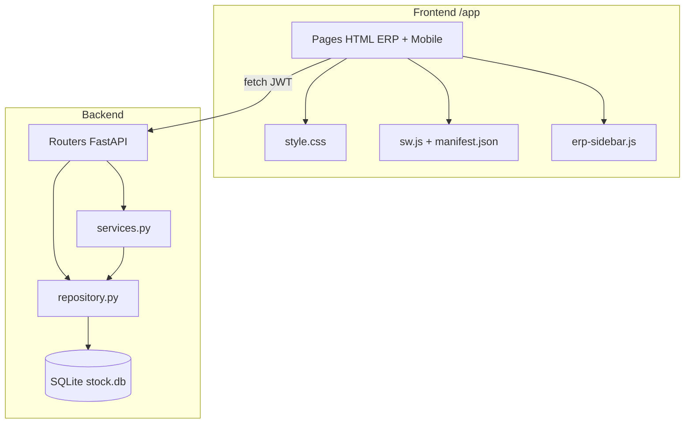
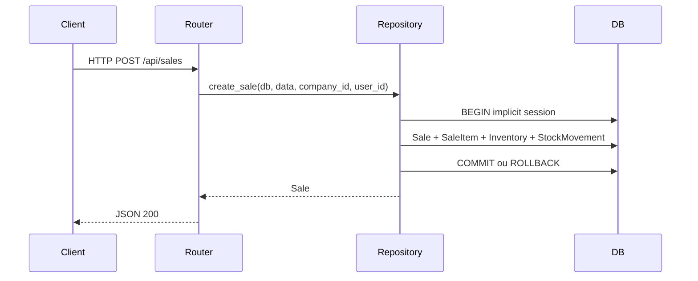

# OMISTOCK — Walkthrough architectural (refactoring complet)

Document de synthèse pour la soutenance : présentation des évolutions techniques appliquées au projet **OMISTOCK** (ERP de gestion de stock multi-tenant).

**Stack :** FastAPI + SQLAlchemy (SQLite) · Frontend HTML/JS + Tailwind CDN · PWA mobile terrain

**Accès application :** `http://localhost:8000/app/` (API : port 8000)

---

## Vue d’ensemble



| Étape | Objectif | Livrables principaux |
|-------|----------|----------------------|
| 1 | Centraliser le CSS | `frontend/style.css` |
| 2 | Responsive ERP (sidebar mobile) | `style.css`, `erp-sidebar.js`, 7 pages dashboard |
| 3 | Couche d’accès aux données (DAL) | `backend/repository.py` |
| 4 | Routeurs sans SQL direct | `backend/routers/*.py` |
| 5–6 | PWA mobile installable / hors-ligne | `manifest.json`, `sw.js`, `app_mobile.html` |
| 7 | Extension PWA scanner | `mobile_scan.html`, polices en pré-cache |
| 8 | Documentation | Ce fichier `Walkthrough.md` |

---

## Étape 1 — Séparation HTML / CSS

### Problème initial
Les pages HTML mélangeaient structure, classes Tailwind et styles custom dispersés (blocs `<style>` ou attributs `style="..."` inline).

### Solution
- **Fichier unique** `frontend/style.css` (~550 lignes) : design system OMISTOCK.
- **Lien systématique** `<link rel="stylesheet" href="style.css">` sur toutes les pages.
- **Composants centralisés** : `.glass`, `.gradient-text`, `.card`, `.btn-premium`, `.sidebar`, `.nav-item`, `.status-badge`, scanner (`#reader`, `.ui-overlay`), mobile (`.fab`, `.bottom-nav`), etc.
- **Nettoyage inline** : ex. conteneurs graphiques → `.chart-container` ; barres de progression → `.progress-fill` avec variable CSS `--progress`.

### Bénéfice pédagogique
Respect du principe **séparation des préoccupations** : HTML = structure, CSS = présentation, JS = comportement.

---

## Étape 2 — Menu responsive (ERP desktop)

### Problème initial
Sidebar fixe (`ml-72`) illisible sur mobile ; grilles multi-colonnes non adaptées ; script `toggleMobileMenu` dupliqué sur chaque page.

### Solution
| Élément | Implémentation |
|---------|----------------|
| Marge principale | Classe `.erp-main` : `margin-left: 0` sous **1024px** |
| Overlay | `#sidebar-overlay` semi-transparent (`bg-slate-900/60`, `z-30`) |
| Hamburger | Bouton uniforme `#menu-toggle.menu-toggle.lg:hidden` |
| Toggle sidebar | Classe **`sidebar-visible`** sur `.sidebar` (remplace l’ancienne `open`) |
| Script partagé | `frontend/erp-sidebar.js` (7 pages : dashboard, inventory, sales, reports, suppliers, logs, settings) |
| Grilles | Ex. `reports.html` : `grid-cols-1` → `md:` / `lg:` ; modale transfert : `.transfer-modal-grid` |

### Pages concernées
`dashboard.html`, `inventory.html`, `sales.html`, `reports.html`, `suppliers.html`, `logs.html`, `settings.html`

### Bénéfice
Interface ERP **utilisable sur smartphone** sans refonte framework (Vanilla JS + CSS).

---

## Étape 3 — Couche DAL (`repository.py`)

### Problème initial
Requêtes SQLAlchemy (`db.query`, `db.add`, `db.commit`) directement dans les routeurs → couplage fort, code difficile à tester et à maintenir.

### Solution
Fichier **`backend/repository.py`** : toutes les opérations DB passent par des **fonctions métier** prenant `db: Session` en premier argument.

### Domaines couverts

**Produits**
- `get_products`, `get_product_by_id`, `create_product`, `update_product`, `delete_product`, `get_alerts`

**Ventes & mouvements**
- `get_sales`, `create_sale` (transactionnelle : inventaire + `StockMovement` + `Product`), `get_movements`

**Transferts inter-filiales**
- `get_transfer_requests`, `create_transfer_request`, `approve_transfer_request`, `confirm_transfer_request`

**Référentiels & admin**
- `get_agents`, `create_agent`, `get_branches`, `get_suppliers`, `get_audit_logs`, `clean_database`

### Robustesse
- `try/except` + **`db.rollback()`** sur les écritures.
- `ValueError` métier (stock insuffisant, statut invalide) remontées vers les routeurs → `HTTPException`.

### Schéma logique



---

## Étape 4 — Refactoring des routeurs FastAPI

### Principe
Les routeurs ne contiennent **plus** de `db.query` / `db.add` / `db.commit`. Ils délèguent à :

```python
from backend import repository
```

*(Le `main.py` ajoute la racine projet au `sys.path` pour cet import package.)*

### Fichiers modifiés

| Routeur | Délégation DAL |
|---------|----------------|
| `routers/admin.py` | `clean_database`, `get_audit_logs` |
| `routers/auth.py` | `create_agent`, `get_agents` |
| `routers/products.py` | CRUD produits, alertes, branches, fournisseurs, ventes, mouvements |
| `routers/transfers.py` | Cycle complet des transferts |

### Responsabilités conservées dans les routeurs
- Authentification : `get_current_user`, JWT.
- Validation HTTP : codes 400/403/404/500.
- Audit métier : `services.log_audit` après certaines actions (ventes, transferts).
- Statistiques dashboard / MCP : `services.py` (logique agrégée non déplacée en DAL dans ce refactoring).

### Bénéfice
Architecture en **3 couches** claire pour l’oral : **Présentation (routers) → Accès données (repository) → Persistance (models + SQLite)**.

---

## Étapes 5 & 6 — PWA mobile (application terrain)

### Objectif
Rendre l’app mobile de scan **installable** et **résiliente hors-ligne** pour l’UI et les librairies statiques (pas les appels API métier).

### Fichiers créés

#### `frontend/manifest.json`
| Champ | Valeur |
|-------|--------|
| `name` | OMISTOCK Mobile Client |
| `short_name` | OMISTOCK Mobile |
| `start_url` | `app_mobile.html` |
| `display` | `standalone` |
| `background_color` | `#f8fafc` |
| `theme_color` | `#0f172a` |
| `icons` | `icon-192.png`, `icon-512.png` |

#### `frontend/sw.js`
- Cache : **`omistock-cache-v2`**
- **Pré-cache à l’installation** : pages locales, `style.css`, `erp-sidebar.js`, icônes, CDN (Tailwind, html5-qrcode, Feather Icons), **Google Fonts** (Inter + Outfit).
- Stratégie **Stale-While-Revalidate (SWR)** sur `fetch` :
  - Réponse servie depuis le cache si disponible.
  - Mise à jour silencieuse en arrière-plan via le réseau.
- **Exclusion** des routes `/api/*` du cache (données toujours fraîches quand en ligne).

#### Pages enregistrant le Service Worker
- `app_mobile.html` — manifest + meta PWA + `navigator.serviceWorker.register('./sw.js')`
- `mobile_scan.html` — idem (étape 7)

### Comportement hors-ligne attendu

| Fonctionnel | Hors-ligne |
|-------------|------------|
| Affichage UI, styles, scanner (libs cachées) | Oui |
| Login / API stock / ventes | Non (nécessite le backend) |

### Test rapide (soutenance)
1. Ouvrir `http://localhost:8000/app/app_mobile.html`
2. DevTools → **Application** → Manifest + Service Worker actif
3. Console : `[OMISTOCK PWA] Service Worker enregistré avec succès`
4. Onglet **Network** → cocher **Offline** → recharger : l’interface reste visible

---

## Arborescence des fichiers clés (après refactoring)

```
omistock/
├── Walkthrough.md              ← ce document
├── stock.db
├── backend/
│   ├── main.py                 (+ sys.path racine projet)
│   ├── repository.py           ← DAL (étape 3)
│   ├── models.py
│   ├── services.py
│   ├── database.py
│   └── routers/
│       ├── admin.py            ← sans SQL direct (étape 4)
│       ├── auth.py
│       ├── products.py
│       └── transfers.py
└── frontend/
    ├── style.css               ← CSS unifié (étape 1)
    ├── erp-sidebar.js          ← menu mobile ERP (étape 2)
    ├── manifest.json           ← PWA (étape 5)
    ├── sw.js                   ← Service Worker SWR (étape 6)
    ├── app_mobile.html         ← PWA principale
    ├── mobile_scan.html        ← PWA scanner (étape 7)
    ├── icon-192.png
    ├── icon-512.png
    └── dashboard.html, inventory.html, … (pages ERP)
```

---

## Lancement du projet (démo soutenance)

```powershell
cd backend
..\ .venv\Scripts\Activate.ps1   # si venv à la racine
python -m uvicorn main:app --host 127.0.0.1 --port 8000 --reload
```

| Interface | URL |
|-----------|-----|
| Connexion ERP | http://127.0.0.1:8000/app/index.html |
| Dashboard | http://127.0.0.1:8000/app/dashboard.html |
| Mobile / PWA | http://127.0.0.1:8000/app/app_mobile.html |
| Scanner | http://127.0.0.1:8000/app/mobile_scan.html |
| API Swagger | http://127.0.0.1:8000/docs |

**Comptes démo** (selon seed) : `admin@test.com`, `food_admin@test.com`

---

## Messages clés pour le professeur

1. **Frontend maintenable** : un seul `style.css` et scripts partagés (`erp-sidebar.js`) au lieu de duplication.
2. **Responsive métier** : sidebar ERP utilisable sur mobile (hamburger + overlay + grilles adaptatives).
3. **Backend professionnel** : pattern **Repository / DAL** isolant SQLAlchemy des routeurs HTTP.
4. **Transactions critiques** : ventes et transferts gérés atomiquement dans la DAL (`rollback` si échec).
5. **PWA terrain** : manifest + Service Worker SWR pour installer l’app et supporter le scan hors-ligne côté assets.

---

## Évolutions possibles (hors scope actuel)

- Déplacer `services.get_dashboard_stats_data` et `dependencies.get_current_user` vers la DAL.
- Migrer les polices Google en self-host pour un cache 100 % offline.
- Passer `erp-sidebar.js` sur toutes les pages auth (`index.html`, `signup.html`) si besoin.
- Tests unitaires sur `repository.py` avec base SQLite en mémoire.

---


---

## Etape 9 - Inscription Entreprise & Schema DB

### Nouveau modele Company (models.py)
- commercial_register_number, activity_sector, nif, address, email, phone
- Migration automatique au demarrage via run_db_migrations() dans main.py

### Nouveau modele User (models.py)
- is_active (Boolean, default=True)
- deletion_deadline (DateTime, nullable)

### Frontend signup.html
- Champs RC, NIF, Secteur, Telephone, Adresse ajoutes
- API : POST /register/enterprise

---

## Etape 10 - RBAC (Role-Based Access Control)

dependencies.py - 3 niveaux:
- get_current_admin : ADMIN uniquement (Backup, Restore, Clean, Seed)
- get_current_agent_human : ADMIN + HUMAIN (Agents, Transferts)
- get_current_agent_ai : ADMIN + HUMAIN + AGENT (MCP)
- get_current_user bloque les comptes inactifs (is_active=False)

---

## Etape 11 - Soft-Delete & Purge

- Desactivation : is_active=False, deletion_deadline=now+30j
- Reconnexion avant 30j : reactivation automatique
- Reconnexion apres 30j : purge en cascade + erreur 401

---

## Etape 12 - Backup & Restore

- GET /api/admin/backup : zip SQLite
- POST /api/admin/restore : JSON (reinsertion), SQL (executescript), DB (ecrasement)

---

## Etape 13 - Informations Entreprise

- GET /api/company : lecture
- PUT /api/company : mise a jour (Admin)
- settings.html charge et sauvegarde les donnees via API (plus de donnees statiques)

---

*Document mis a jour - Etapes 1 a 13 - Soutenance OMISTOCK ERP.*
